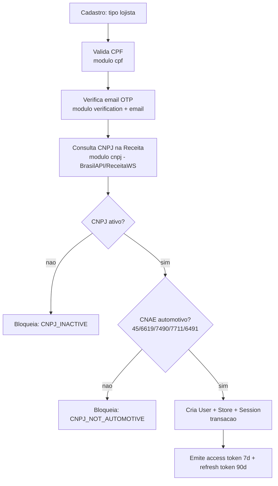
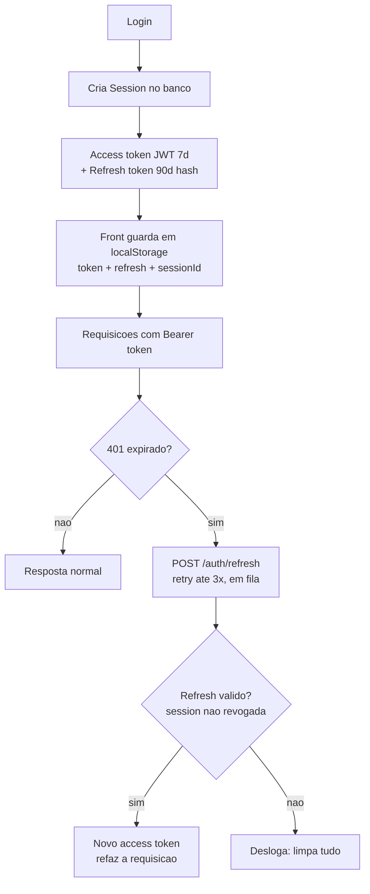
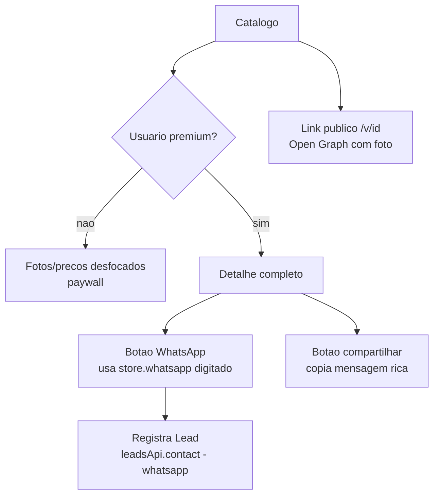
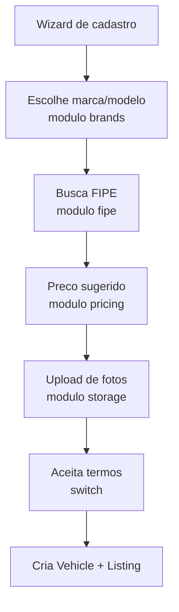
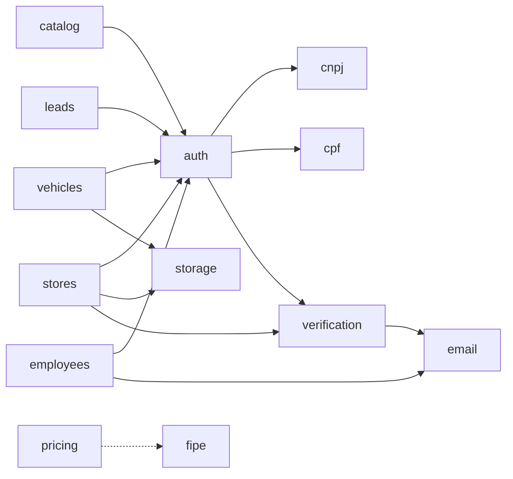
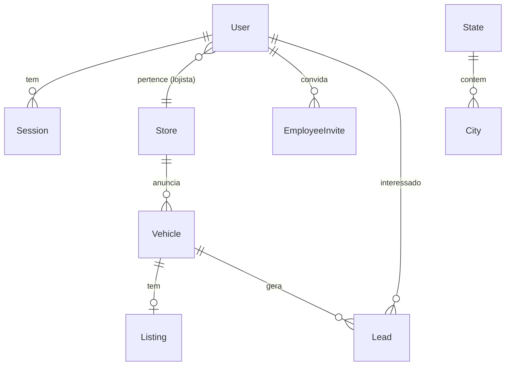

# Arquitetura & Mapa de Features — RadarAuto

> **Para que serve este documento:** mapear as features do RadarAuto e **como elas se conectam**. É o ponto de entrada para entender o projeto interligado — seja você, a equipe, ou uma IA assistente.
>
> **Leia também:** [`README.md`](../README.md) (visão geral + como rodar) · [`docs/RULES.md`](./RULES.md) (convenções e regras numeradas) · [`docs/DEPLOYMENT.md`](./DEPLOYMENT.md) (deploy).

---

## 1. O que é o RadarAuto

Marketplace de carros **abaixo da tabela FIPE**, com **dois públicos**:

- **Compradores** — assinam para ver oportunidades (catálogo com paywall) e falar com lojas.
- **Lojistas / revendedores** — anunciam estoque, recebem leads qualificados, gerenciam funcionários.

**Stack:** Next.js 15 + React 19 + TS (front) · NestJS 10 + Prisma 6 + Postgres 16 (back) · Zustand + TanStack Query · pnpm + Turborepo · JWT (access + refresh) + argon2id.

---

## 2. Mapa de Features

Cada feature, onde mora no código e o que toca. (back = `apps/api/src/modules/` · front = `apps/web/src/app/`)

| Feature                                    | Módulo (back)      | Tela (front)                                            | Entidades                   | Depende de                  |
| ------------------------------------------ | ------------------ | ------------------------------------------------------- | --------------------------- | --------------------------- |
| **Autenticação** (login, sessão, refresh)  | `auth`             | `(public)/login`, `(public)/cadastro`                   | User, Session               | cnpj, cpf, verification     |
| **Cadastro lojista** (CNPJ + CNAE)         | `auth` + `cnpj`    | `(public)/cadastro`                                     | User, Store, Session        | cpf, verification, cnpj     |
| **Verificação OTP** (email/SMS)            | `verification`     | steps do cadastro, modais                               | Verification                | email                       |
| **Validação CPF**                          | `cpf`              | step do cadastro                                        | —                           | —                           |
| **Consulta CNPJ + CNAE automotivo**        | `cnpj`             | (usado no cadastro)                                     | —                           | — (APIs externas)           |
| **Catálogo** (público + paywall + preview) | `catalog`          | `(authed)/app/catalogo`, `(public)/v/[id]`              | Vehicle, Listing, Store     | auth                        |
| **Cadastro de veículo**                    | `vehicles`         | `(authed)/app/cadastrar-veiculo`                        | Vehicle, Listing            | auth, storage, fipe/pricing |
| **Preço sugerido (FIPE)**                  | `pricing` + `fipe` | wizard de cadastro                                      | —                           | — (FIPE)                    |
| **Leads / Visualizações**                  | `leads`            | `(authed)/app/leads`                                    | Lead                        | auth                        |
| **Loja** (perfil, telefone/WhatsApp)       | `stores`           | `(authed)/app/configuracao`                             | Store                       | auth, storage, verification |
| **Funcionários** (convites)                | `employees`        | `(authed)/app/funcionarios`, `(public)/convite/[token]` | EmployeeInvite, User        | auth, email                 |
| **Perfil do usuário**                      | `users`            | `(authed)/app/configuracao`                             | User                        | auth, verification          |
| **Sessões** (dispositivos)                 | `sessions`         | `(authed)/app/configuracao`                             | Session                     | auth                        |
| **Planos / assinatura**                    | (auth + promo)     | `(authed)/app/planos`                                   | User (plan, subscription\*) | auth                        |
| **Marcas**                                 | `brands`           | (cadastro de veículo)                                   | Brand                       | —                           |
| **Localidades** (estado/cidade)            | `locations`        | (cadastro, filtros)                                     | State, City                 | —                           |
| **Upload de imagens**                      | `storage`          | (fotos de veículo/loja)                                 | —                           | (Supabase Storage)          |
| **Email transacional**                     | `email`            | (OTP, convites)                                         | —                           | (Resend)                    |

---

## 3. Fluxos principais (como as features se conectam)

### 3.1 Cadastro de lojista

O cadastro encadeia validações e só cria a conta ao final. CNPJ é verificado na Receita **e** filtrado por CNAE automotivo.

> Telefone: `store.phone` vem da Receita; `store.whatsapp` é o que o lojista digita. O detalhe do veículo usa o **whatsapp** (digitado).

### 3.2 Autenticação & sessão (refresh token)

Sessões vivem no banco (revogáveis). Access token curto + refresh longo, com renovação automática no front.

> **Sessão única (exceto lojista):** ao logar, funcionario/revendedor/admin têm as sessões anteriores revogadas. Lojista pode múltiplos dispositivos. O `JwtStrategy` valida `revokedAt` a cada request (Regra 7).

### 3.3 Catálogo, paywall e leads

### 3.4 Cadastro de veículo

---

## 4. Grafo de dependências (backend)

Quais módulos cada feature usa. `common` e `prisma` são transversais (omitidos). Setas = "usa".

> **Núcleo:** `auth` é o centro — quase tudo depende dele (autenticação). `cnpj`, `cpf`, `verification` alimentam o cadastro. `storage` serve uploads (veículos, lojas). `email` envia OTP e convites.

---

## 5. Entidades do banco (modelos Prisma)

Visão das entidades e relações principais (`apps/api/prisma/schema.prisma`).

| Entidade                 | Papel                                                                  |
| ------------------------ | ---------------------------------------------------------------------- |
| **User**                 | Conta (lojista, funcionario, revendedor, admin). Tem plano/assinatura. |
| **Session**              | Sessão ativa (dispositivo). Guarda refresh token (hash). Revogável.    |
| **Verification**         | Códigos OTP (email/phone) com expiração e tentativas.                  |
| **Store**                | Loja do lojista (dados da Receita + telefone/whatsapp digitados).      |
| **Vehicle**              | Veículo anunciado (fotos, specs, preço, FIPE).                         |
| **Listing**              | Estado do anúncio (status, aprovação).                                 |
| **Lead**                 | Interesse de um comprador num veículo (score, sinais).                 |
| **EmployeeInvite**       | Convite de funcionário (token).                                        |
| **Brand / State / City** | Tabelas de apoio (marcas, localidades).                                |
| **AuditLog**             | Trilha de auditoria.                                                   |

---

## 6. Onde fica cada coisa (índice rápido)

**Backend** (`apps/api/src/modules/<modulo>/`): cada módulo tem `*.controller.ts` (rotas), `*.service.ts` (regra), `dto/` (validação). Núcleo de auth em `auth/` (+ `jwt.strategy.ts`, `auth.service.ts`).

**Frontend** (`apps/web/src/`):

- Telas autenticadas: `app/(authed)/app/<tela>/`
- Telas públicas: `app/(public)/<tela>/`
- Cliente HTTP + token: `lib/api.ts` (localStorage + interceptor de refresh)
- APIs por feature: `lib/<feature>-api.ts` (auth-api, leads-api, stores-api...)
- Navegação por role: `lib/nav-config.ts`
- Estado global: `stores/auth.store.ts`

**Tipos compartilhados:** `packages/types/src/` (contratos entre front e back).

**Convenções/regras:** ver [`docs/RULES.md`](./RULES.md) — as "Regras N" citadas nos comentários do código.

---

## 7. Como manter este documento vivo

> ⚠️ Documentação desatualizada é pior que nenhuma. **Atualize este arquivo junto com o código** quando:

- **Adicionar uma feature** → nova linha na tabela (§2) + ajustar diagramas se mudar conexões.
- **Criar um módulo** → atualizar o grafo de dependências (§4).
- **Mudar o schema** → atualizar o ER (§5) e a tabela de entidades.
- **Mudar um fluxo** (cadastro, auth, etc.) → atualizar o diagrama Mermaid correspondente (§3).

**Para a IA:** este arquivo é o ponto de entrada. Ao começar a trabalhar no RadarAuto, leia-o para entender features, conexões e onde fica cada coisa. Os diagramas Mermaid são lidos nativamente. Para detalhes de uma feature, vá ao módulo indicado na tabela §2.

**Dica de fluxo:** sempre que pedir uma feature nova à IA, peça também para atualizar este `ARCHITECTURE.md` no mesmo passo — assim o mapa nunca fica para trás.

---

_Última atualização: gerado a partir da estrutura real do projeto (19 módulos back, 14 telas front, 11 modelos). Mantenha a data ao editar._
